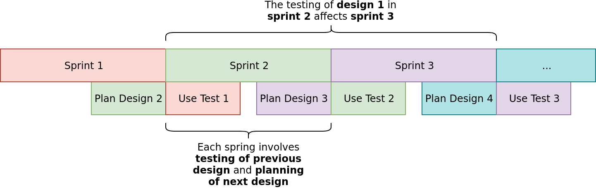
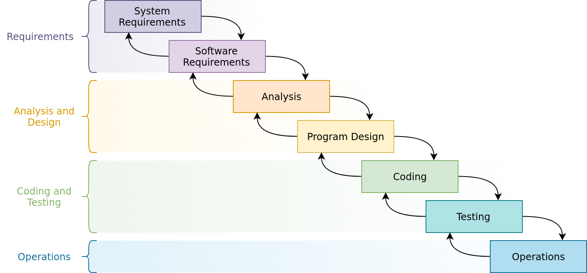
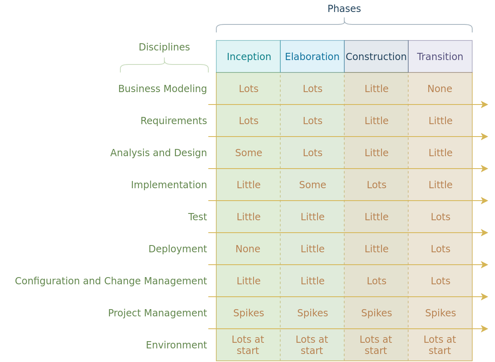
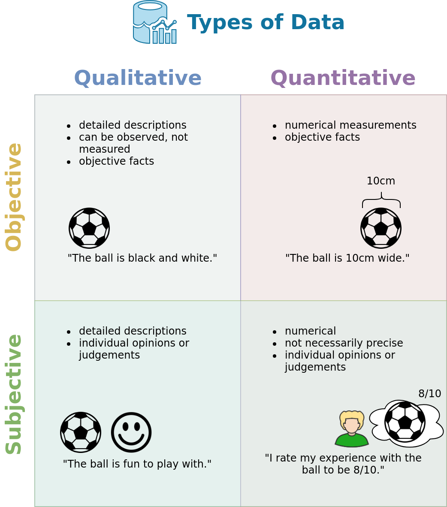
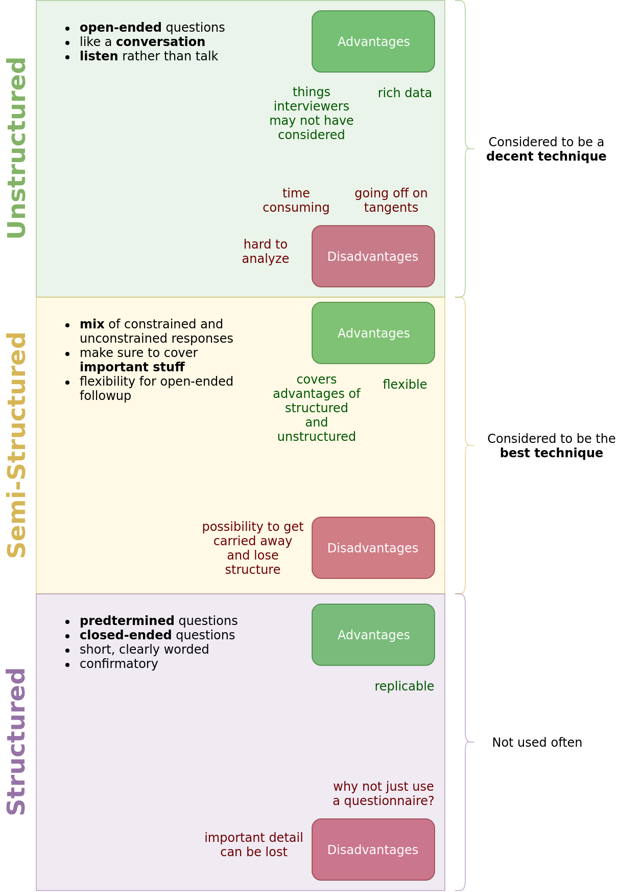
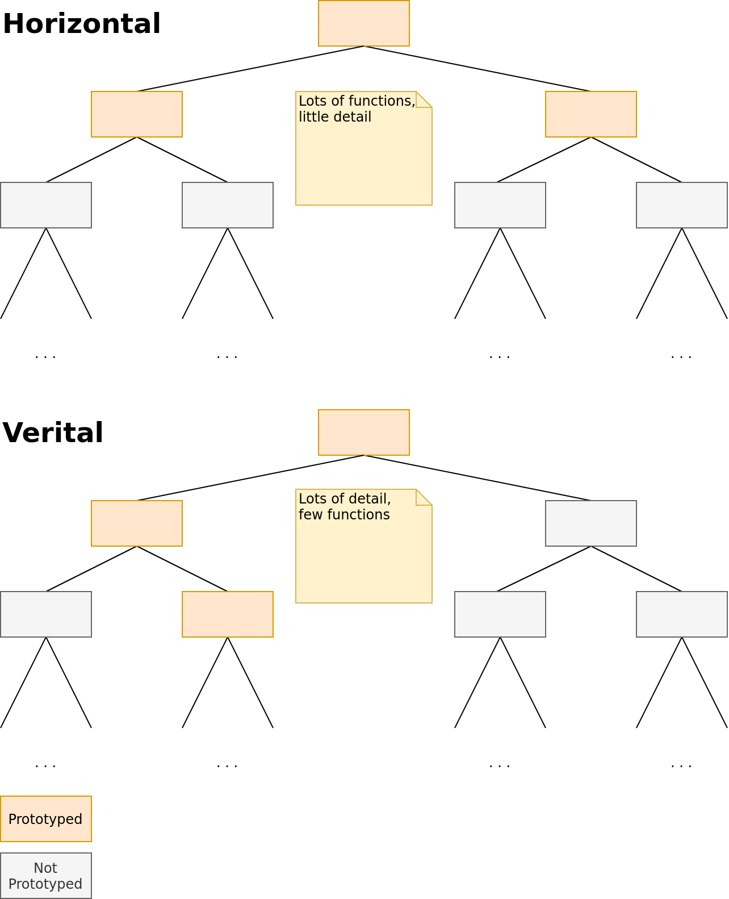

---
author: |
  | William Findlay
title: |
  | COMP3008 Midterm Notes
date: \today
bibliography: /home/housedhorse/.bibs/uni.bib
csl: /home/housedhorse/.bibs/ieee.csl
subparagraph: yes
header-includes: |
  ```{=latex}
  \usepackage{float}
  \usepackage{listings}
  \usepackage[hang,bf]{caption}
  \usepackage{framed}
  \usepackage[section]{placeins}

  \usepackage[dvipsnames,table]{xcolor}

  \usepackage{pifont}

  \allowdisplaybreaks

  \usepackage[bottom]{footmisc}
  % fancy headers/footers
  \makeatletter
  \usepackage{fancyhdr}
  \lhead{\@author}
  \chead{}
  \rhead{\@title}
  \lfoot{}
  \cfoot{\thepage}
  \rfoot{}
  \renewcommand{\headrulewidth}{0.4pt}

  \usepackage{amsmath, amsfonts,amssymb, amsthm}
  \usepackage{siunitx}
  \usepackage[boxruled,lined,linesnumbered,titlenumbered]{algorithm2e}

  \usepackage{setspace}
  \usepackage{changepage}
  \usepackage[explicit]{titlesec}
  \usepackage{aliascnt}

  \floatplacement{figure}{!htbp}
  \floatplacement{table}{!htbp}
  \lstset{numbers=left,breaklines=true,frame=single,language=Python,captionpos=t,abovecaptionskip={\abovecaptionskip},
  belowcaptionskip={0.5em},aboveskip=\intextsep,showstringspaces=false,identifierstyle=\color{Blue},
  commentstyle={\color{OliveGreen}},keywordstyle={\bfseries\color{Orange}},stringstyle=\color{Purple},mathescape=true}
  \setlength{\captionmargin}{1in}

  \newgeometry{margin=1in}

  \newtheoremstyle{plain}
  {12pt}   % ABOVESPACE
  {12pt}   % BELOWSPACE
  {\itshape}  % BODYFONT
  {0pt}       % INDENT (empty value is the same as 0pt)
  {\bfseries} % HEADFONT
  {.}         % HEADPUNCT
  {5pt plus 1pt minus 1pt} % HEADSPACE
  {}          % CUSTOM-HEAD-SPEC

  \newtheoremstyle{definition}
  {12pt}   % ABOVESPACE
  {12pt}   % BELOWSPACE
  {\normalfont}  % BODYFONT
  {0pt}       % INDENT (empty value is the same as 0pt)
  {\bfseries} % HEADFONT
  {.}         % HEADPUNCT
  {5pt plus 1pt minus 1pt} % HEADSPACE
  {}          % CUSTOM-HEAD-SPEC

  \newtheoremstyle{remark}
  {12pt}   % ABOVESPACE
  {12pt}   % BELOWSPACE
  {\normalfont}  % BODYFONT
  {0pt}       % INDENT (empty value is the same as 0pt)
  {\itshape} % HEADFONT
  {.}         % HEADPUNCT
  {5pt plus 1pt minus 1pt} % HEADSPACE
  {}          % CUSTOM-HEAD-SPEC

  \theoremstyle{plain}

  % define theorem
  \newtheorem{theorem}{Theorem}[section]
  \providecommand*{\theoremautorefname}{Theorem}

  % define lemma
  \newtheorem{lemma}{Lemma}[section]
  \providecommand*{\lemmaautorefname}{Lemma}

  % define claim
  \newtheorem{claim}{Claim}[section]
  \providecommand*{\claimautorefname}{Claim}

  % define corollary
  \newtheorem{corollary}{Corollary}[section]
  \providecommand*{\corollaryautorefname}{Corollary}

  % define proposition
  \newtheorem{proposition}{Proposition}[section]
  \providecommand*{\propositionautorefname}{Proposition}

  % define conjecture
  \newtheorem{conjecture}{Conjecture}[section]
  \providecommand*{\conjectureautorefname}{Conjecture}

  \theoremstyle{remark}

  % define observation
  \newtheorem{observation}{Observation}[section]
  \providecommand*{\observationautorefname}{Observation}

  % define remark
  \newtheorem{remark}{Remark}[section]
  \providecommand*{\remarkautorefname}{Remark}

  \theoremstyle{definition}

  % define example
  \newtheorem{example}{Example}[section]
  \providecommand*{\exampleautorefname}{Example}

  % define definition
  \newtheorem{definition}{Definition}[section]
  \providecommand*{\definitionautorefname}{Definition}

  \newcommand{\blackbox}{\hfill$\blacksquare$}
  \usepackage{tikz}
  \newcommand*\circled[1]{\tikz[baseline=(char.base)]{
              \node[shape=circle,draw,inner sep=2pt] (char) {#1};}}

  \renewcommand{\labelitemi}{\large$\bullet$}
  \renewcommand{\labelitemii}{\ding{226}}
  \renewcommand{\labelitemiii}{\tiny$\blacksquare$}
  \renewcommand{\labelitemiv}{\small$\triangleright$}

  \titleformat{\paragraph} % command to change
  [runin]                  % shape  (runin, etc.)
  {\bfseries}              % format (bfseries, itshape, etc.)
  {}                       % label  (thesection, thesubsection, etc.)
  {0em}                    % separation between label and body
  {#1}        % before the body
  [.]                       % after the body

  \titleformat{\subparagraph} % command to change
  [runin]                  % shape  (runin, etc.)
  {\itshape}              % format (bfseries, itshape, etc.)
  {}                       % label  (thesection, thesubsection, etc.)
  {0em}                    % separation between label and body
  {#1}        % before the body
  [.]                       % after the body

  \let\lil\lstinputlisting
  \usepackage{afterpage}
  \hypersetup{colorlinks, allcolors=., urlcolor=blue}

  \usepackage{etoolbox}% http://ctan.org/pkg/etoolbox
  \makeatletter
  \patchcmd{\lst@GLI@}% <command>
    {\def\lst@firstline{#1\relax}}% <search>
    {\def\lst@firstline{#1\relax}\def\lst@firstnumber{#1\relax}}% <replace>
    {\typeout{listings firstnumber=firstline}}% <success>
    {\typeout{listings firstnumber not set}}% <failure>
  \makeatother

  \renewcommand\lstlistlistingname{List of Listings}
  \usepackage{chngcntr}
  \counterwithin{figure}{section}
  \counterwithin{table}{section}

  \usepackage{booktabs}
  \usepackage{longtable}
  \usepackage{array}
  \usepackage{multirow}
  \usepackage{wrapfig}
  \usepackage{float}
  \usepackage{colortbl}
  \usepackage{pdflscape}
  \usepackage{tabu}
  \usepackage{threeparttable}
  \usepackage{threeparttablex}
  \usepackage[normalem]{ulem}
  \usepackage{makecell}
  \pagestyle{fancy}

  \renewcommand{\sectionautorefname}{Section}
  \renewcommand{\subsectionautorefname}{Subection}
  \renewcommand{\subsubsectionautorefname}{Subection}
  \renewcommand{\paragraphautorefname}{}
  \renewcommand{\subparagraphautorefname}{}

  \usepackage{nameref}

  \makeatletter
  \renewcommand{\theparagraph}{\bfseries \@currentlabelname}
  \renewcommand{\thesubparagraph}{\itshape \@currentlabelname}
  \makeatother
  ```
output:
  pdf_document:
    number_sections: true
    fig_crop: true
    fig_caption: true
    keep_tex: false
---
```{r,include=FALSE}
knitr::opts_chunk$set(echo = FALSE)
options(kableExtra.latex.load_packages = FALSE)
library(kableExtra)
```
\thispagestyle{empty}
\counterwithin{lstlisting}{section}
\newpage
\pagenumbering{roman}
\thispagestyle{plain}
\tableofcontents
\newpage
\thispagestyle{plain}
\listoffigures
\listoftables
\lstlistoflistings
\newpage
\pagenumbering{arabic}
\setcounter{page}{1}

# Design Concepts

## What is Design/UX?

- interaction design
  - make interactive products
  - support the way people communicate interact
  - interdisciplinary
    - not just HCI
- user experience (UX)
  - how a product behaves when used by people
  - how people feel about it
  - every product has a UX
    - software
    - ketchup bottle
    - elevator

### Stages of Design Process

- requirements
- design alternatives
- prototyping
- evaluating

## Advantages of Involving Users in the Design Process

- authenticity
  - domain expertise
  - perspective
- pragmatics
  - expectation management
  - make users active stakeholders (ownership)

## Usability Goals and Testing

- usability means (EESUML)
  1. Effective
  1. Efficient
  1. Safe to use
  1. Utility
  1. Memorability
  1. Learnability

### Testing of Usability Goals

- we care about *human performance*, not *computer performance*
- iterative design
  - find problems
  - fix them
  - do more tests

\newpage

- Agile Development (\autoref{agile})
  - sprint $N$ $\implies$ test $N-1$ and plan $N+1$



\FloatBarrier

- Early Developer Method
  - involve developers in design process early
  - figure out technical limitations
  - less knowledge transfer
- Continued Designer Involvement Method
  - design reviews, deliverables
  - more design at start, more development at end
- Royce's Waterfall (\autoref{waterfall})
  - not a great choice
  - iteration is better



\clearpage

- Rational Unified Process (\autoref{rational-unified})
  - not a great choice
  - iteration is better



## Common Design Principles

### Visibility

- show state of system, possible actions
  - make it clear what user needs to do

### Affordance

- actions suggested by design of an object
  - perceived must match actual
  - false affordance
    - "looks like a button but can't be pressed"

### Constraints

- limit actions based on appearance
  - physical
  - cultural
  - logical

### Consistency

- establish similarities
  - similar operation and elements for similar tasks
  - consistency with other software
  - consistency with real world

### Feedback

- show consequences after actions
  - auditory
  - visual
  - haptic


# Requirements Gathering

## Basic Tasks

- requirements
- design alternatives
- prototyping
- evaluating

## Basic Principles

- early focus on tasks/users
- empirical measurement
  - quantifiable usability criteria
- iterative design

## Personas

- reflect stakeholders
- capture user characteristics
- bring them to life
  - name
  - background
  - characteristics
  - goals
  - frustrations
- advantages
  - have a clear picture of users
  - humanize the design process

## Scenarios

- description of someone using a product to achieve a goal
  - keep product general
  - include setting, actors, background, tools/objects
  - use stakeholders' language


# Data Gathering

## Types of Data

- qualitative, quantitative
  - qualitative = descriptions
  - quantitative = numerical
- objective, subjective
  - objective = facts
  - subjective = opinions

{height=70%}

\FloatBarrier

## Questionnaires

- good for background requirements
- good to measure system usability
- what people say is not always what they think

### Open-Ended vs Closed-Ended Questions

- closed $\implies$ easier to analyze
- open $\implies$ not limited to what researcher considered

### Likert Orindal Scale Questions

- rate from strongly agree to strongly disagree
  - odd number $\implies$ neutral option
  - even number $\implies$ no fence-sitting
- reverse half of questions to avoid acquiescence bias

### Semantic Scales

- similar to Likert
  - opposite adjectives on either end of the scale

### Ranked

- rank a list in order of preference
  - forced choice

### Multiple Choice

- make sure all options are covered

## Observation

### Simple Observation

- user is given a task
  - just watch them complete it
- no insight into through process

### Think-Aloud

- user is given a task
  - watch them complete it
  - they describe what they are thinking at each step
- can be unnerving for participants

### Co-Discovery

- two users work together on a task
  - watch them complete it
  - they talk to each other
- more natural than think-aloud
  - still gives insight into through process

### Ethnography

- observe the user in a natural setting
  - how do they solve their everyday problems?

## Interviews

{height=80%}


# User Studies

## Choosing a Type of Study

- evaluation goals
  - overall
  - pre-design
- evaluation questions
  - based on goals
- types of data
  - what types of data do you need to answer questions?
  - \autoref{study-type}

\begin{table}
\caption{Types of data to choose from.}
\label{study-type}
\centering

\begin{tabular}{|l|l|}
\hline\bfseries
Type &
\bfseries
Description\\
\hline\bfseries
Time on Task &
Controlled lab study; data logs.\\
\hline\bfseries
Opinions &
Interviews; questionnaires.\\

\hline\bfseries
Thought Process &
Think aloud; observation; interviews.\\

\hline\bfseries
Personal Recollections &
Interviews; questionnaires.\\

\hline\bfseries
Physiological Measures &
Eye tracker.\\

\hline\bfseries
Real Usage Pattern &
Ethnography; interviews.\\
\hline
\end{tabular}
\end{table}

## Lab-Based User Study

- controlled environment
- direct observation, "think aloud"
- often preliminary

## Field-Based User Study

- regular settings
  - for weeks, months
- possibly more valid than lab-based
  - data could also be messier

## Web-Based User Study

- more natural setting
- uncontrolled
- difficult to verify demographic info

## Crowd-Sourced User Study

- online crowdsourcing sites
  - fast and cheap
  - quickly gather large amounts of data

## Biases and Effects

- novelty effect
  - "Hey, this is cool!"
- Hawthorne effect
  - "I'm in a study; I'm important!"
- Observer-expectancy effect
  - "I'm being watched; I'd better do this right!"

## Main Types of Experiment

- between subject
  - different subject for each experimental condition
- within subject
  - same subjects for each experimental condition

## Ethics

- TCPS
  1. Respect for Persons
  1. Concern for Welfare
  1. Justice
  1. Respect Vulnerable Populations
  1. Balance Harm and Benefits
- summary of principles
  1. Treat all subjects with respect.
  1. Obtain explicit voluntary consent.
  1. Make users feel comfortable.
  1. Don't waste user's time.
  1. Answer questions at any time.
  1. Maintain user privacy.


# Prototyping

## Why Prototype?

- elicit feedback
- refine requirements
- choose between alternatives
- communication with stakeholders
- evaluate/test ideas

## Low Fidelity

- medium unlike final medium
  - quick, cheap, easy to change
- sketches
- storyboards
- index cards
- Wizard of Oz

### Storyboards

- series of sketches
- captions
- numbered sequence
- follows a scenario

### Wizard of Oz

- user images interacting with a computer
  - it is a developer responding, rather than the system
- understand user expectations

### Conceptual Design

- describe system
  - based on user needs/requirements
- what functions?
- how are functions related?
- what information?

## High Fidelity

- use materials closer to final product
  - looks more like final system
  - users might think they have the full system
  - limits user imagination

## Horizontal vs Vertical

{height=57%}


# Qualitative Analysis and Cognitive Processes

- subjective
- inductive
  - draw conclusions from smaller samples
- affinity diagrams
  - data grouped as "themes"

## Simple Analysis

- identify recurring themes
- categorize data
- focus on key events

## Grounded Theory

- derive theory from the data
- three levels of coding
  - open
    - identify categories
  - axial
    - link to sub-categories
  - selective
    - find relationships between categories


# Inspection Methods

## Heuristic Evaluation

- evaluate these heuristics
  1. visibility of system status
  1. match between system and real world
  1. user control and freedom
  1. consistency and standard
  1. error prevention
  1. recognition over recall
  1. flexibility and efficiency of use
  1. aesthetic and minimalist design
  1. error recognition + recovery
  1. help and documentation
- assign ratings to problems
  0. Not a problem
  1. Cosmetic problem
  1. Minor problem
  1. Major problem
  1. Catastrophe

## Cognitive Walkthrough

- walk through entire app
- ask three questions at each step
  1. Will the user know how to accomplish the task?
  1. Will user see what they should use to accomplish the task?
  1. Will the user know they made the correct action from feedback?


# Cognitive Frameworks

## Gulf of Execution and Evaluation


# Conceptual/Mental Models


# Types of Interfaces in HCI
